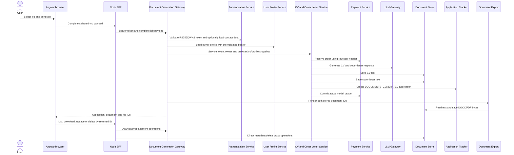
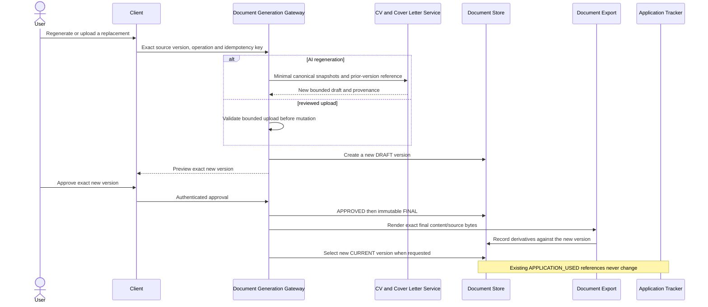
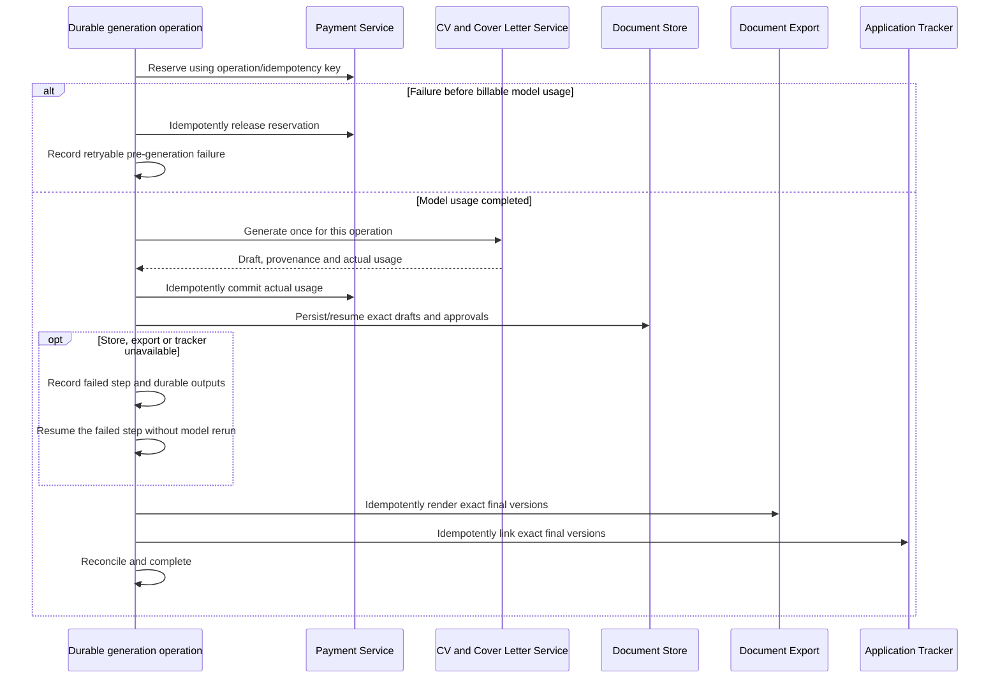

# DOCGEN-01 document-generation architecture verification

- Verification date: 2026-07-24
- Status: Approved architecture boundary; runtime implementation remains incomplete
- Source issue: [DOCGEN-01](https://github.com/jobseekercopilot/document-generation-gateway/issues/4)
- Parent epic: [AI CV and cover letter generation ready for private beta](https://github.com/jobseekercopilot/document-generation-gateway/issues/1)
- Canonical decision: [Document architecture and ownership ADR at accepted revision](https://github.com/jobseekercopilot/document-store-service/blob/fedcdbdec63795269c4e4c4f43fc32f38c6327b1/docs/adr/0001-document-architecture-and-ownership.md)

## Decision use

The Document Store ADR is the one cross-repository architecture decision for
this journey. This document verifies that decision from the Gateway boundary;
it does not create a competing ADR or claim that the target flow is already
implemented.

The machine-readable
[`document-generation-ownership.json`](document-generation-ownership.json)
pins the reviewed source revisions and the owner of every target state.
[`synthetic-document-generation-trace.json`](synthetic-document-generation-trace.json)
exercises the approved happy-path transitions without personal data, provider
credentials or a paid model request. Gateway CI rejects duplicate/missing state
owners, an altered canonical decision, an incomplete repository decision, or a
trace that mutates state through a non-owner.

## Evidence reviewed

The verification baseline records the exact merged revisions for Gateway,
CV/Cover Letter, Store, Export, Application Tracker, Payment, LLM, Profile,
Job, Client and Infrastructure. The review covered:

- controller and orchestration source in Gateway and CV/Cover Letter Service;
- producer OpenAPI contracts for every runtime dependency;
- Store document/version/file entities and Application Tracker lifecycle;
- Payment reservation, commit and release behavior;
- the browser generation/download/replacement UI;
- base/E2E Compose topology and Infrastructure build tools;
- the deterministic target trace checked by `scripts/verify_architecture.py`.

The baseline is evidence for this decision only. It is not a compatible fleet
manifest and does not replace producer-owned contract pins.

## Current implemented flow



Verified current properties:

- Gateway authenticates the browser with the platform RS256/JWKS contract and
  derives owner context from the token subject.
- Gateway's direct CV/Cover Letter, Store, Export and Application Tracker
  boundaries now use distinct service identities and owner context where their
  merged contracts require it.
- The generation request still trusts the browser's employer, title,
  description and source fields instead of resolving a canonical Job Service
  snapshot.
- CV/Cover Letter Service still owns the synchronous call chain into Payment,
  LLM, Store and Application Tracker. Its outbound identities and owner
  contracts are not yet a beta trust boundary.
- Store persists two active generated rows before any user review. Application
  Tracker immediately creates `DOCUMENTS_GENERATED`; there is no approval
  record.
- Gateway then exports both documents synchronously. There is no durable
  operation, idempotency key, deadline budget or recovery state across partial
  failures.

The current source therefore does not satisfy the approved state split even
though its direct inbound trust boundary has improved.

## Target flow

```mermaid
sequenceDiagram
    actor User
    participant Browser as Angular browser
    participant BFF as Same-origin BFF/session
    participant Gateway as Document Generation Gateway
    participant Auth as Authentication Service
    participant Job as Job Service
    participant Profile as User Profile Service
    participant Payment as Payment Service
    participant Generator as CV and Cover Letter Service
    participant LLM as LLM Gateway
    participant Store as Document Store
    participant Export as Document Export
    participant Tracker as Application Tracker

    User->>Browser: Generate for selected canonical job ID
    Browser->>BFF: Job ID and idempotency key
    BFF->>Gateway: Authenticated request; no owner/service headers
    Gateway->>Auth: Validate the platform identity contract
    Gateway->>Gateway: Derive owner; create durable operation
    Gateway->>Job: Resolve versioned canonical job snapshot
    Gateway->>Profile: Resolve allowlisted profile snapshot
    Gateway->>Payment: Idempotently reserve estimated model usage
    Gateway->>Generator: Owner-bound minimal snapshots and operation ID
    Generator->>LLM: Authorized bounded generation request
    LLM-->>Generator: Draft response, model usage and provider evidence
    Generator-->>Gateway: Bounded drafts and claim provenance only
    Gateway->>Payment: Idempotently commit actual model usage
    Gateway->>Store: Persist CV and cover letter as DRAFT versions
    Gateway-->>Browser: Operation and exact draft versions for review
    User->>Browser: Explicitly approve exact versions
    Browser->>BFF: Approval command
    BFF->>Gateway: Authenticated operation/version approval
    Gateway->>Store: Record APPROVED and immutable FINAL versions
    Gateway->>Export: Render each exact FINAL version
    Export->>Store: Persist generated bytes against exact versions
    Gateway->>Tracker: Create one owner-scoped application with exact version IDs
    Gateway->>Gateway: Record COMPLETED
    Gateway-->>Browser: Application and downloadable file metadata
```

The operation is a durable coordinator, not a second system of record for
documents, files, payments or applications. Every command is owner-bound and
idempotent. If generation fails before model use completes, the reserved
credit is released. Once model usage is incurred, Payment records it even when
later persistence fails; the operation resumes later steps rather than
silently refunding or regenerating. Store, export and application-link failures
remain visible and retryable without mutating an approved version or creating a
second charge/application.

### Regeneration and replacement



Regeneration never edits an existing version. Selecting a new `CURRENT`
version affects future use only. Application Tracker continues to reference
the exact historical final version used by an existing application.

### Failure recovery



No cross-service call is treated as a distributed database transaction.
Retries use the operation and exact version IDs. A failure cannot manufacture
an application before approval, rerun a paid model call, mutate historical
content or create a second billing result.

## State ownership

| State or concern | One authoritative owner | Boundary |
| --- | --- | --- |
| Authenticated human identity | Authentication Service | Token subject; never a browser owner header |
| Canonical job snapshot | Job Service | Gateway references an immutable/versioned snapshot |
| Allowlisted profile input | User Profile Service | Gateway records only the version/reference needed by the operation |
| Operation, idempotency and recovery | Document Generation Gateway | Coordination facts only |
| Prompt, response schema and claim provenance | CV and Cover Letter Service | Returns bounded output; no direct Store, Tracker or Payment ownership |
| Model provider transport and usage response | LLM Gateway | No document/application lifecycle state |
| Reservation, committed usage and release | Payment Service | Idempotently keyed to the operation |
| `DRAFT` document version | Document Store | Authoritative persisted review version |
| `APPROVED` document version | Document Store | Records acceptance of the exact version |
| immutable `FINAL` version | Document Store | Content cannot be rewritten after finalisation |
| `EXPORTED` binary state and bytes | Document Store | Export transforms; Store records durable metadata/bytes |
| `APPLICATION_LINKED` exact version references | Application Tracker | Created only after explicit approval/finalisation |
| Preview and approval interaction | Client | Presents server state; it owns no authoritative lifecycle state |

`APPROVED` records the explicit decision about an exact draft. `FINAL` denotes
the sealed, immutable representation of that approved version; it is not a
second current-selection or application status. Export Service is deliberately
not the owner of `EXPORTED`: success exists only when Store durably records the
derivative against the exact final version. Application Tracker may reference
that final version but never owns its content.

## Trust boundaries

1. The browser uses the same-origin BFF/session boundary and cannot choose
   owner or workload identity headers.
2. Gateway validates the platform token and owns the durable operation.
3. Gateway loads canonical Job/Profile snapshots rather than trusting domain
   facts supplied by the browser.
4. Every backend hop authenticates its workload and binds owner context derived
   from the validated subject. Each state owner independently authorizes the
   requested resource/transition.
5. CV/Cover Letter and Export process bounded content but cannot persist or
   link state except through an owning service's authorized contract.
6. Logs and traces use correlation/operation references and exclude document
   content, tokens, raw owner identifiers and personal filenames.

## Repository decisions

### Application Tracker

`jobseekercopilot/application-tracker-service` remains a standalone private
repository. It is the only runtime system of record for an application,
application lifecycle and the exact final document-version references used by
that application. Gateway coordinates its producer call; Store and CV/Cover
Letter do not create a competing application record.

### Build Tools

There is no standalone `build-tools` GitHub repository. The current
`build-tools/` source belongs to the private
`jobseekercopilot/infrastructure` repository and has no runtime role in this
flow. [INFRA-01](https://github.com/jobseekercopilot/infrastructure/issues/2)
owns ratification of the wider extraction boundary, while
[INFRA-06](https://github.com/jobseekercopilot/infrastructure/issues/7) owns
publishing versioned Maven build artifacts. DOCGEN-01 neither creates another
repository nor copies shared build source into Gateway.

## Implementation ownership and remaining blockers

This verification assigns work without implementing it:

- canonical snapshots and bounded orchestration:
  [GW-02](https://github.com/jobseekercopilot/document-generation-gateway/issues/13);
- CV/Cover Letter responsibility reduction:
  [CVCL-01](https://github.com/jobseekercopilot/cv-cover-letter-service/issues/9);
- draft/review/approval UI:
  [DOCGEN-16](https://github.com/jobseekercopilot/job-seeker-copilot-client/issues/32);
- exact application linkage:
  [DOCGEN-17](https://github.com/jobseekercopilot/document-generation-gateway/issues/8);
- idempotency and duplicate protection:
  [DOCGEN-09](https://github.com/jobseekercopilot/document-generation-gateway/issues/7);
- immutable Store lifecycle and cross-resource recovery:
  [DOC-06](https://github.com/jobseekercopilot/document-store-service/issues/12),
  [STORE-03](https://github.com/jobseekercopilot/document-store-service/issues/4)
  and [DOC-08](https://github.com/jobseekercopilot/document-store-service/issues/13);
- deterministic browser evidence:
  [DOC-12](https://github.com/jobseekercopilot/e2e/issues/16) and
  [DOCGEN-23](https://github.com/jobseekercopilot/document-generation-gateway/issues/11).

No capability becomes beta-enabled through this architecture verification.
